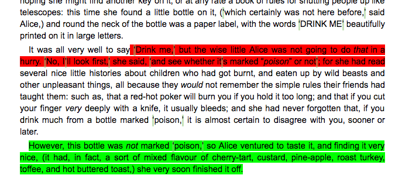

NLP Google App Script + Google Doc + Natural Language Processing App

Step - 
	Set up new project in Google App Engine
	Config App Script for positive and negative threshold
	Config display color : yellow for neutral, red for negative, green for positive
	Call API in App Script installed in Google Doc
	Receive response sentiment points +/-0.0 +/- 1.0
	Visual markup
	
